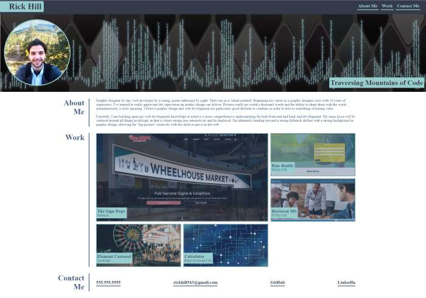

# My Portfolio

## Description

This repo contains a basic portfolio layout for my past, current, and future projects. This portfolio was built using strictly HTML and CSS to showcase my work and information.

 

* The Sign Dept.
    * This web project was for a graphics and sign company that I currently work for. With 27 pages full of content, this was no small task and was built with HTML, CSS, JavaScript, and jQuery.
* Run-Buddy
    * The Run-Buddy project is a web landing page built to encourage lead generation for a physical training company. This page was built using the latest and greatest out of CSS. Flex and Grid workflows were utilized to layout the page in a clean and easy fashion.
* Horiseon Marketing Services
    * The HSM (Horiseon Marketing Services) landing page was a project built to advertise various web marketing solutions and strategies.

 

This portfolio is intended to demonstrate competency in various programming languages and the ability to composite those skills seamlessly.

 

Working with CSS grid layout is... interesting, to say the least, but not that bad once you understand the concept. Other than CSS grid, CSS variables are another technique I'm getting familiar with. These two relatively new CSS techniques are becoming the standard so implementing these tools now is essential.

 

[Rick Hill's Portfolio](https://rickhill543.github.io/my-portfolio/)

***

## Installation

N/A

***

## Usage

For showcasing core competencies and skills for possible future employers.

 

***

## Credits

Diamond Pattern Image by <a href="https://pixabay.com/users/viscious-speed-1744878/?utm_source=link-attribution&amp;utm_medium=referral&amp;utm_campaign=image&amp;utm_content=1900579">Speedy McVroom</a> from <a href="https://pixabay.com/?utm_source=link-attribution&amp;utm_medium=referral&amp;utm_campaign=image&amp;utm_content=1900579">Pixabay</a>

Circuit Concept Image by <a href="https://pixabay.com/users/geralt-9301/?utm_source=link-attribution&amp;utm_medium=referral&amp;utm_campaign=image&amp;utm_content=2440249">Gerd Altmann</a> from <a href="https://pixabay.com/?utm_source=link-attribution&amp;utm_medium=referral&amp;utm_campaign=image&amp;utm_content=2440249">Pixabay</a>

Carnival Image by <a href="https://pixabay.com/users/harutmovsisyan-2839589/?utm_source=link-attribution&amp;utm_medium=referral&amp;utm_campaign=image&amp;utm_content=1492099">Harut Movsisyan</a> from <a href="https://pixabay.com/?utm_source=link-attribution&amp;utm_medium=referral&amp;utm_campaign=image&amp;utm_content=1492099">Pixabay</a>

W3Schools for always being there | 
[W3Schools](https://www.w3schools.com/)

 

***

## License

All Rights Reserved.